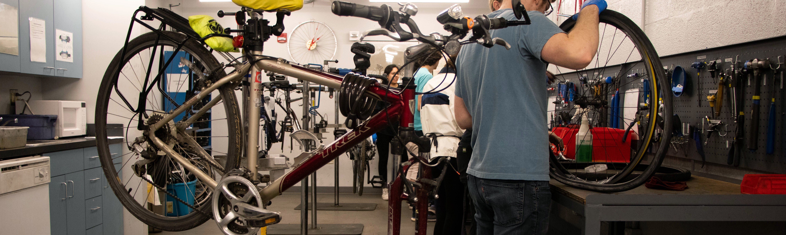

 

##  Software Development and Analysis Intern 
### {:style="margin-bottom: 5px;""} &nbsp;&nbsp; Dunkirk, Maryland, USA
---

 
I am an intern at the Aerospace Engineering and Research Associate (AERA). I develop a tracking tool in Python to monitor the impact of COVID-19 on US flight performance. Since March 2020, the US air industry went through many economical doldrums. Although Airline such as Southwest promote the policy that they will keep the middle seats open, tourists still do not prefer air travel. (In November 2020) Air travel in the US is only half of the travel before the pandemic.  

  
  Number of flights in the US per day
   

We publish our analytical data for both Metropolitan Air-Hubs and different commercial airlines on [Greenlandings.org](http://greenlandings.org/).

 
<a href="/index.html#Back2AREA">Back</a>
   

##  SAT Math Teacher 
### {:style="margin-bottom: 5px;""} &nbsp;&nbsp; Shanghai, China
---
 
{:style="float: left;margin-right: 30px;margin-top: 39px;margin-bottom: 79px"}
I was an SAT Math Teacher at [New Oriental](https://en.wikipedia.org/wiki/New_Oriental) in Shanghai. New Oriental is one of the biggest and leading education organizations in China. I oversaw over 100 students and offered them mock tests, leading to an average of 10% increase in their test scores.

Teaching is fun and yet making friends with my students is even more satisfying. I found out incorporating friendship into their learning process greatly help them grow, learn, and achieve better scores. Some of my students went to prominent universities such as Emory University, Ohio State University, University of Connecticut, University of Toronto and etc.
  
<a href="/index.html#Back2SAT">Back</a>

   
##  Bike Shop Mechanics
### {:style="margin-bottom: 5px;""} &nbsp;&nbsp; College Park, Maryland, USA
---
 

  

As an employee of University of Maryland Recreation and Wellness (Recwell), I helped repair UMD students’ bikes. My services include assembling bikes from parts, fixing bad braking pads and brakes, and cleaning the chain. Fun fact: Most of the problems are just fixing braking pads and tire repairs and I believe them can fix the problem themselves if given a clear instruction and proper tools.

The uniqueness of our bike shop is we aim at **educating students on helpful bike knowledge and repair tips**; so in the future when bike shop is not open, students are able to fix their bikes on their own.
