 

##  Lab Assistant
### {:style="margin-bottom: 5px;""} &nbsp;&nbsp; Washington D.C., USA
---
 

### Computer Vision (CV)
**Simplified Definition**: How computer sees the world and gather useful information from the digital images and videos.

Computer vision is an interdisciplinary scientific field that deals with how computers can gain high-level understanding from digital images or videos. From the perspective of engineering, it seeks to understand and automate tasks that the human visual system can do.

### Application of CV
- Medical Treatment (See through human body)
  - Computed tomography (CT)
  - MRI
- Unmanned Transportation
  - Autonomous driving vehicles such as Tesla, Toyota, and Cadillac
  - Mars Rover
- Machine Vision
  - Manufacturing quality control
  - 3D scanning
- Everyday life
  - Face recognization
- etc.

 
### Research Content
[View Manuscript Here](https://iopscience.iop.org/article/10.1088/2515-7647/abcbe4)

**Abstract: This experiment investigate** 
 **- the accuracy comparison of two prevalent 3D imaging methods: FPP and 3D-DIC.** 
 **- how the geometric angles between key hardware components affect the accuracy** 

### Fringe Projection Profilometry (FPP)

### 3D Digital Image Correlation (3D-DIC)
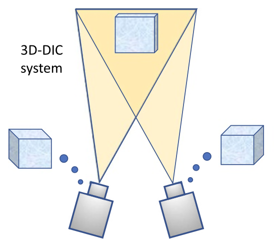{:style="float: left;margin-right: 30px;margin-top: 15px;margin-bottom: 30px"} 
The 3D-DIC technique is a stereo vision method that performs 3D imaging and shape measurements using two images captured by two separate cameras, typically one on the left side and the other on the right side.

The 3D-DIC technique can determine the shape of the object by matching points in a subset of region to the same subset in the other image.(See figures below) The two cameras are on different position, therefore, there is certain transform between two captured images. (You can simulate the same process by covering one eye using one hand and quickly shifts to cover the other one.)

 
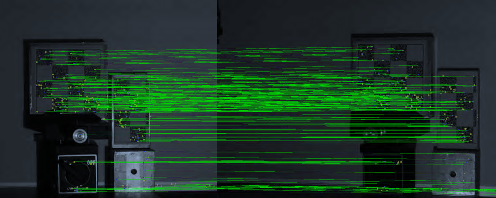
  
From the camera calibration process, we already know what the angles between cameras, intrinsic and extrinsic parameters are. With the help from the already known parameters, we can match the subsets in two images using computer programs. Then from Math calculation, we can determine the length, width, and height of that region of the object. By iterating through the whole object, we can gather the three dimensional information of the whole object.   

### Camera Calibration

### Experiment
**1. System Geometry**

**2. 360-degree 3D image reconstruction**

  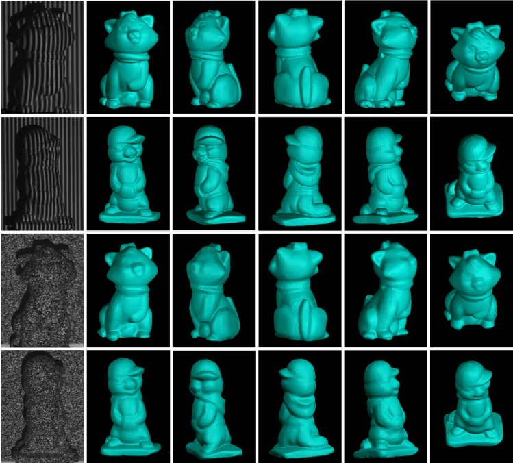
  The first two rows demonstrate representative results acquired by the FPP technique, and the following two rows show representative results obtained by the 3D-DIC technique.
   

 

**3. System resolution comparison**

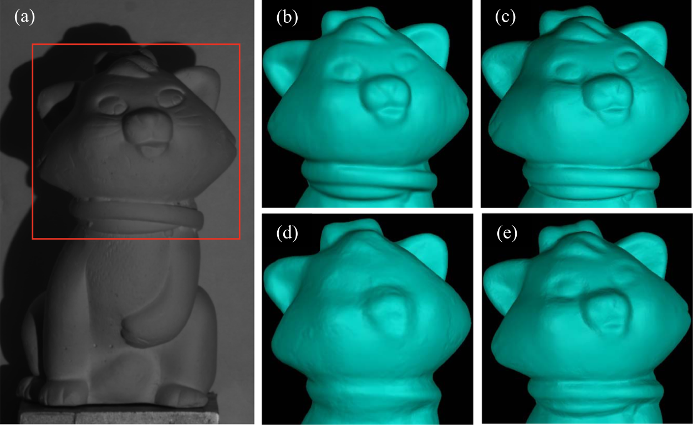{:style="float: left;margin-right: 30px;margin-top: 55px;margin-bottom: 30px"} 
  3D reconstruction results from the FPP and 3D-DIC techniques from two different imaging resolutions. 
  - (a) is a grayscale image of the object with a region of interest (ROI) selected. 
  - (b)–(c) represent the 3D results from the FPP measurements at initial and higher spatial resolutions, respectively. 
  - (d)–(e) demonstrate the 3D results from the 3D-DIC measurements at initial and higher resolutions, respectively.

In this experiment, the field of view is reduced to about half of the previous experiments. In the meantime, everything remained the same. Figure 7 displays the comparison of the acquired 3D reconstruction results with the ones obtained in the previous experiments. It is evident from a visual comparison that higher resolution can substantially improve the performance of both techniques, especially the 3D-DIC one.

<a href="/index.html#Back2CV">Back to Main Page</a>
    

##  Senior Thesis Research - Honor
### {:style="margin-bottom: 5px;""} &nbsp;&nbsp; College Park, Maryland, USA
---
 
I worked with Professor Douglas Hamilton at the department of Astronomy, University of Maryland. My senior honor thesis research was part of the NASA DART project.
 
### [Double Asteroid Redirection Test (DART) Mission](https://www.nasa.gov/planetarydefense/dart)
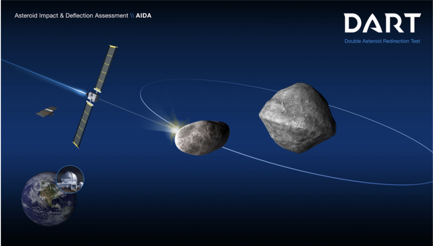{:style="float: left;margin-right: 30px;margin-top: 15px;margin-bottom: 10px"} 
Double Asteroid Redirection Test is a planetary defense test and it is the first demonstration to use
kinetic impactor technique.

(Simplified goal: Scientists use rockets to hit and change the orbit of the asteroid so it will not destroy the Earth.) The target asteroids are Didymos and its moon.
  
- Didymos-A (primary body) is **(780 ± 8) meters**
- Didymos-B (moonlet) is about **160-meters** in size
- The distance between the primary body and the moonlet is **1.18km**
- DART will be launched using SpaceX rocket in California in **late July 2021**
- DART is predicted to impact moonlet in **late September 2022**
- Ground-based telescopes will measure the change in momentum imparted to Didymos B

[**Here is a simulated impact movie in action**](https://www.youtube.com/watch?v=8zooPRmgUPI)
  
### My research
In order to calculate how the collision will affect the asteroid's orbit, we have to study how the particles on the asteroid would distribute and spread after the collision event. **Our research aimed at converting the surface data (Left) obtained from telescope observations to an actual 3D shape data consists of 109 cubes (Right)**.
From the 3D shape, we could calculate the gravitation field of the asteroid and its moon and then we could study and understand how the particle will spread after the collision.

|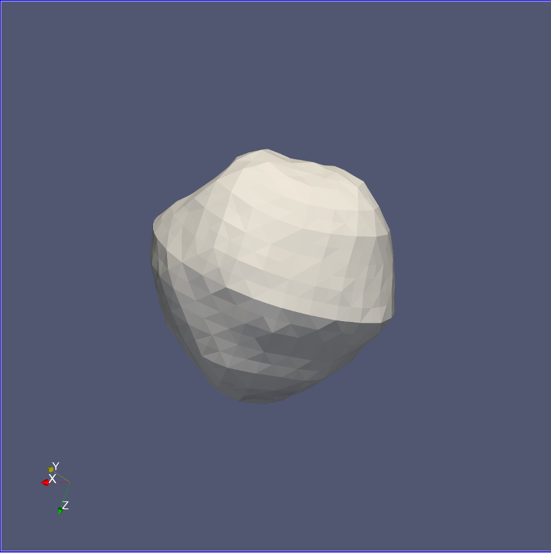 | 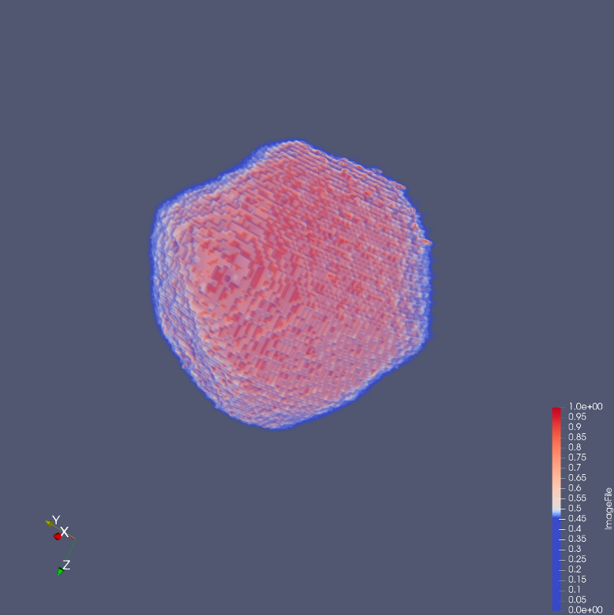 |
|:--:||:--:|
| *Raw Data:  Didymos-A surface from telescope observation* | *After algorithm:  Didymos-A 3D shape data consists of cubes* |

My algorithm worked as follows:
1. Create a space with 100 x 100 x 100 cubes
2. Find out the location of the surface in the space
3. Mark space outside as 0 (None), space with borders as 0.5 (Half-filled), and space inside as 1 (Filled)
4. Perform error-checking functions to see
  - if the input/provided surface data is complete and correct
  - if the constructed surface is complete

The image on the bottom-right shows a sketch 2D cross-section of the 3D shape.

- 1 = inside ;  0.5 = border ;  0 = outside

| 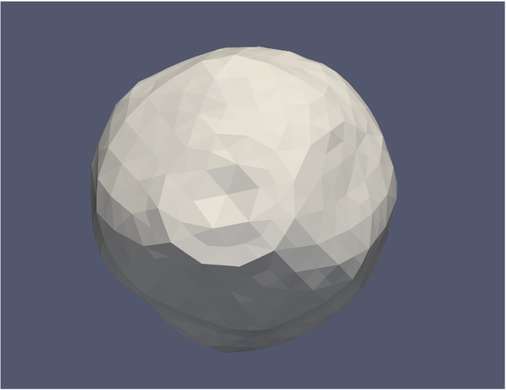 | 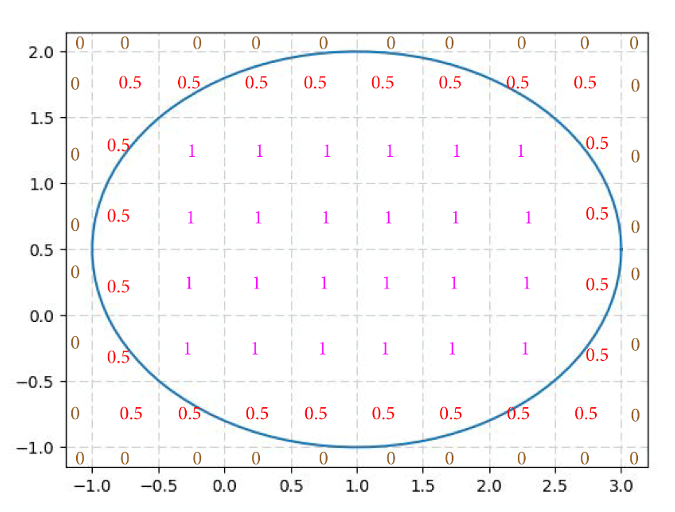 |
|:--:||:--:|
| *Didymos-A at another angle* |  *2D cross section print of the 3D shape* |

<a href="/index.html#Back2DART">Back to Main Page</a>
    

##  ASIAA Summer Student Program
### {:style="margin-bottom: 5px;""} &nbsp;&nbsp; Taipei, Taiwan
---
 
### Trans-Neptunian Object (TNO)
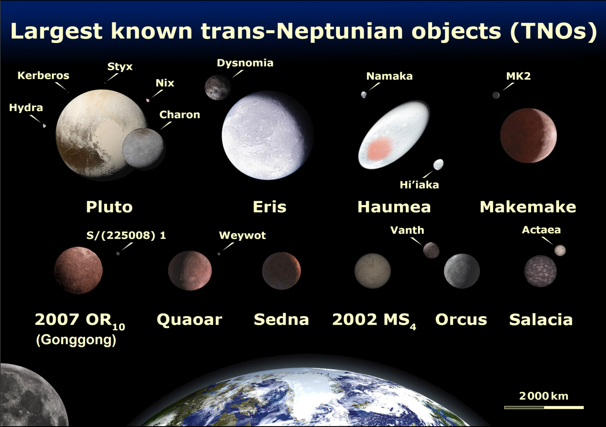{:style="float: left; margin-right: 35px; margin-top: 56px; margin-bottom: 45px"}

**Simplified Definition**: Any "rock" within solar system that is further than planet Neptune is called TNO.

Wikipedia: A trans-Neptunian object (TNO), is any minor planet or dwarf planet in the Solar System that orbits the Sun at a greater average distance than Neptune, which has a semi-major axis of 30.1 astronomical units (AU).

Here are some famous TNOs in the image on the left. Most of them are small, distant, and dim so it is hard for us to see and track them even with telescopes. But scientists believe that by studying the distribution of TNOs, we can discover the evolution of the solar system.
 

### Survey Telescope
Survey telescope is built for ultra-wide area observations. Compared to normal telescope, it can observe many objects at once by scanning a large area of the sky. From the captured images, researcher can determine the orbits of interesting objects. My research project goal is to use simulation to support a proposal to use Subaru Telescope in Hawaii.  
 
### FOSSIL - A Telescope Proposal
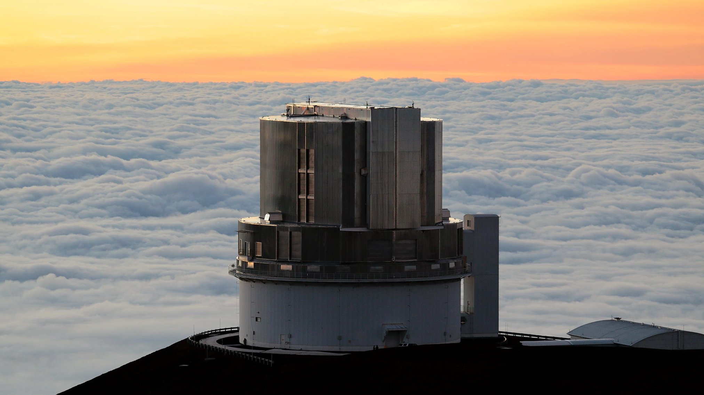{:style="float: right ;margin-left: 35px; margin-top: 15px; margin-bottom: 10px"}

“the Formation of the Outer Solar System: an Icy Legacy” **(FOSSIL) is**

- An ASIAA proposed survey to use Subaru telescope in Hawaii (telescope picture on the right)
- Study TNOs close to ecliptic plane
- Study different sub groups of TNO

All TNOs discovered will be carefully tracked to reliably classify their orbits.
 Total request is **35 nights over 3 years with an average 5 nights per semester**.
  
**FOSSIL will  …**

- Answer fundamental questions about the formation and evolution of the Solar System
- Leverage Subaru Telescope large field of view (**Very wide image capture**) and sensitivity (**See lots dimmer TNOs**) to survey 176 sq.deg. of nightsky and to mr (Stellar object luminosity magnitude) = 26.1

  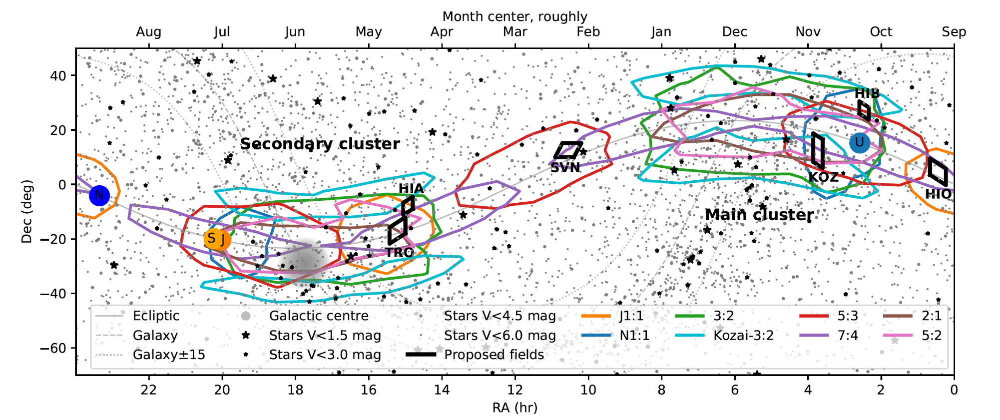
  Areas of interest in the FOSSIL proposal. My research focus on the KOZAI area
   

- The graph above is similar to the map of the Earth, where you convert the whole year night sky globe to a 2D rectangular with Right Ascension (Astronomy Longitude) and  Declination (Astronomy Latitude).
- The Sin/Cos curve is the ecliptic plane (the sun's orbit in our (night) sky)
- N = Neptune; &nbsp;&nbsp; S = Saturn; &nbsp;&nbsp; J = Jupiter; &nbsp;&nbsp; U = Uranus

 
### My research
We wanted to maximize the actual telescope discovery results in the KOZAI regions because of the actual limited telescope observing time. Our simulation used TNO distribution models and ran test observations to see the potential number of TNO detections. We use python and fortran to deploy 20 observation areas around the KOZAI region as shown in the figure below.

  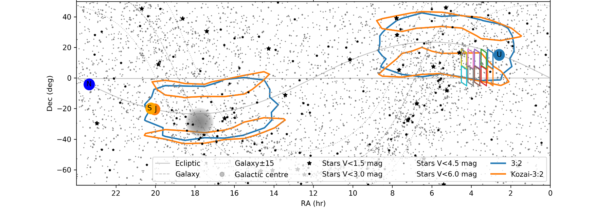
  1 set of 10 observation areas in our simulation
   

And the simulation results on 2 sets of area are shown below, where observation region 6_6 and 6_5 are resulting more TNO detections:

  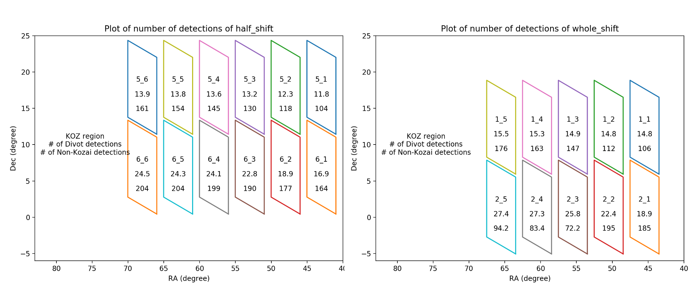
  2 sets of total 20 observation areas in our simulation
   

We updated the result in the proposal for Subaru Telescope. We also conducted research on different models of the TNO distribution to validate different theories.

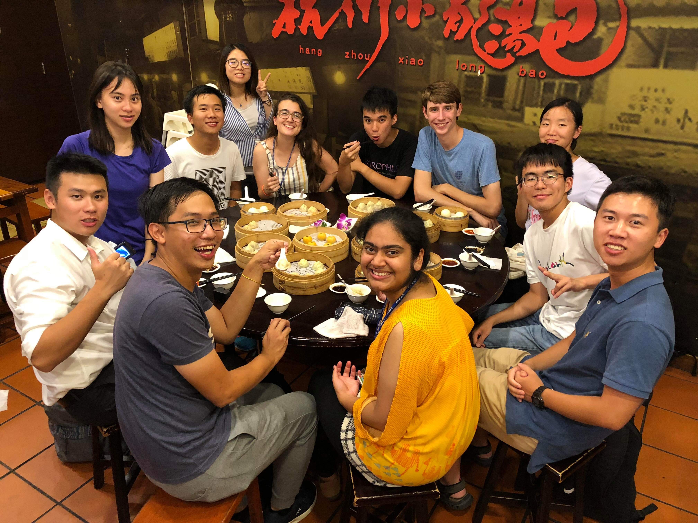{:style="float: left; margin-right: 35px; margin-top: 25px; margin-bottom: 45px"}
 
The Summer Student Program gathered students from the whole world: Taiwan, Mainland China, Hong Kong, Macau, Japan, Malaysia, USA, Spain, and India. The staff and supervisors gave us many academic advices and also tips to travel around. Furthermore, ASIAA has many international scholars from Japan, Europe, Australia, and the US. I would strongly recommend students interested in Astronomy trying to apply for this opportunities!

[ASIAA Summer Student Program Page](http://www.asiaa.sinica.edu.tw/outreach/summerstudent.php)

<a href="/index.html#Back2ASIAA">Back to Main Page</a>
    

##  Independent Research - Observatory
### {:style="margin-bottom: 5px;"} &nbsp;&nbsp; College Park, Maryland, USA
---
 

### Supernova
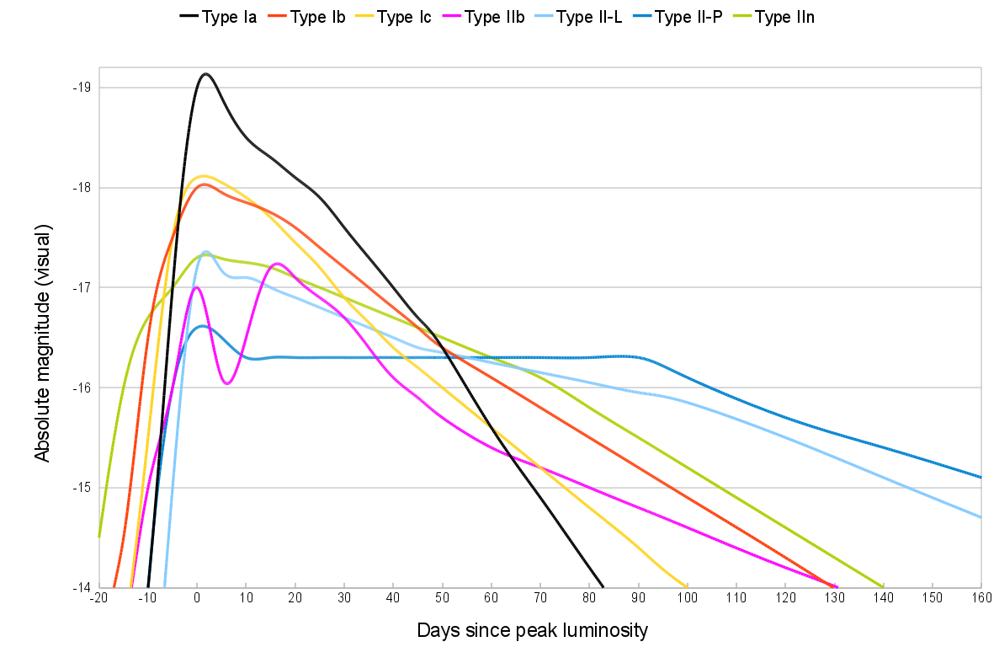

**Simplified Definition**: When massive Star dies, the gravity collapse its core and BOOM!!!

Supernova is the result of a gravitational collapse of a high mass (> 8 solar masses)  stellar core, which releases an enormous amount of energy. The luminosity of the explosion is nearly 10 billion solar luminosity. The supernova will fade over the next few months and the fading rate depends on the type of the supernova. The figure above shows the luminosity change of different types of supernova after the explosion.
  

** Fun Fact: ** Astronomy magnitude is reverse. Smaller (more minus) is brighter. Ex. -26.7 is brighter than -19 (Type Ia peak luminosity)  
### My research
I conducted telescope observation research with [Elizabeth Warner](https://www.astro.umd.edu/people/warnerem.html), the director of the University of Maryland Observatory. We decided to study Type-Ia supernova because its very bright peak luminosity would be easier to observe through our telescope.

  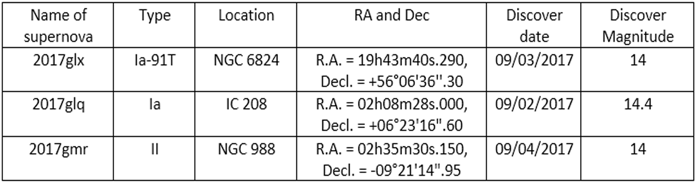
  Detail information on the supernova I observed
   

 
Here are some images taken from the telescope observations, where the cross hair labels the location of the supernova (Near a bright star). I observed the supernova for 8 nights (4 success; 2 half success; 2 failed)

| | 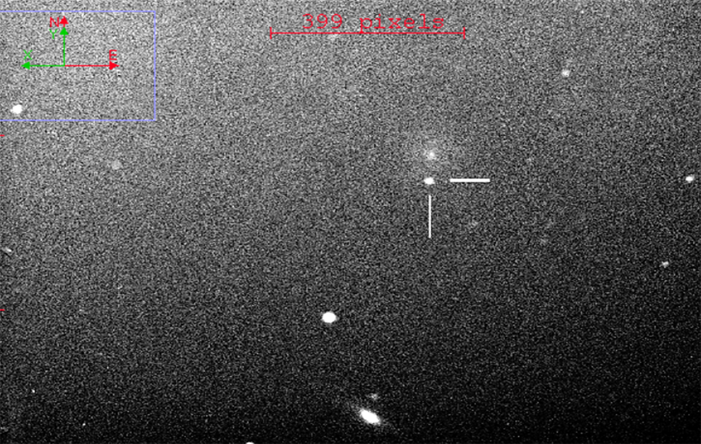|
|:--:||:--:|
| *14 inch reflector telescope* |  *2017 glq*|
| 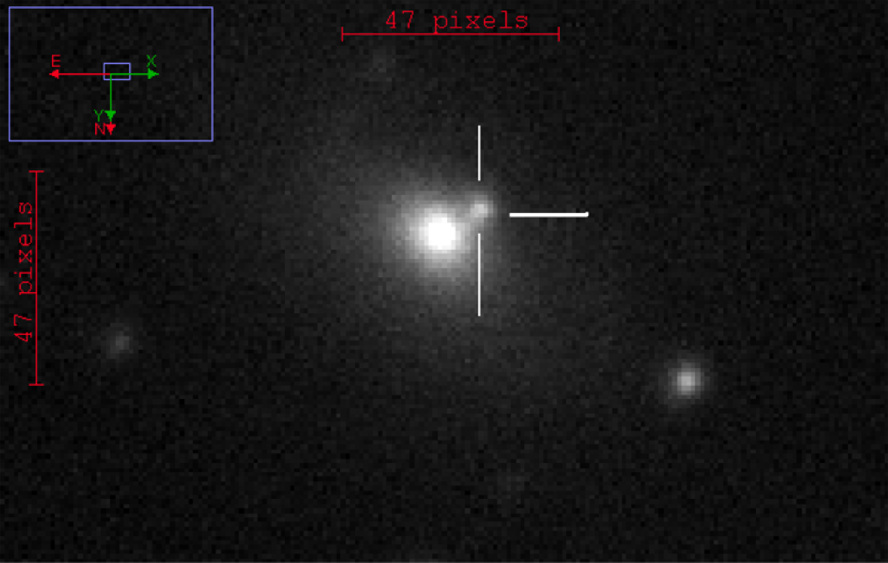| 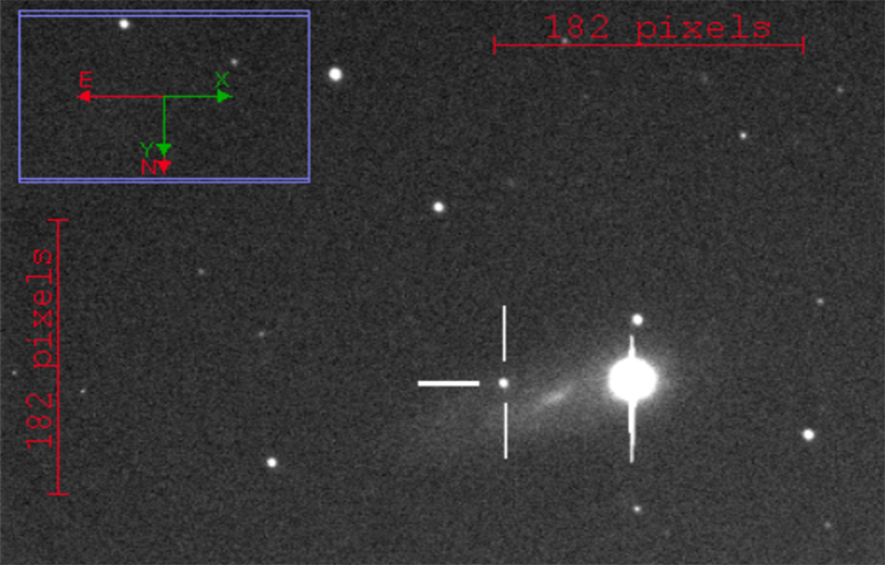|
|  *2017 glx*|  *2017 gmr*|

Each image is a 5-min exposure with clear and sloan r' filter. I took 5 to 10 data points for both clear and Sloan r’ filter (90 mins per supernova). It was very frustrating that a cloud would block the sight of supernova and I had to retake another 5-min image. I used AstroImageJ (an image process software to process the obtained telescope FITS file) to process the image and obtained the following lightcurves.
 

#### * Filter is a glass slice we apply before the camera used to capture the images. The filters block out certain lights so we can focus on light from only certain bandwidth.
- Clear filter = no filter
- Sloan r' filter = Effective central wavelength 620.4nm, FWHM 124.0nm

 
**Here are the results:**

From the data, I calculated the mean and the median of all the data points and plotted with the actual data points. I also calculated the error based on the standard deviation divided by the square root of the number of measurements.

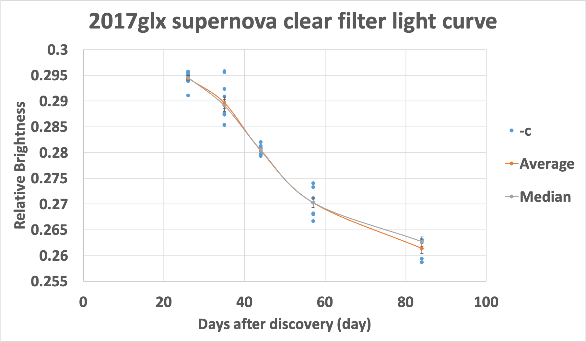{:style="float: left ;margin-right: 35px; margin-top: 15px; margin-bottom: 10px"}
  
The light curve of the 2017glx in clear filter seems to fit in the typical type Ia supernova’s light curve. As time increases, the apparent brightness will drop accordingly as shown in the image on the first image in this section.

{:style="float: right ;margin-left: 35px; margin-top: 25px; margin-bottom: 10px"}
       
However, the light curve of 2017glx in Sloan r’ filter had an overall good shape, except for the final points. The reason is unclear.
      

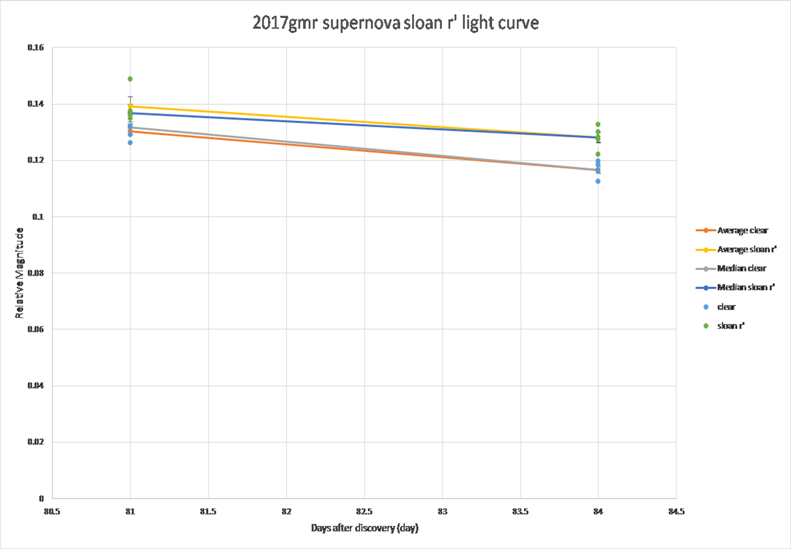{:style="float: left ;margin-right: 35px; margin-top: 1px; margin-bottom: 10px"}

Limited by the data points of 2017gmr, I can only have an ambiguous shape of the light curve. On rochesterastronomy.org,

2017gmr was defined as a type II supernova, but it was not specified. Based on the days after discovery and the slope of the light curve, I assumed it is possible to be a type II-P or type II-L.

  
For 2017 glq, the observations were not successful. Therefore, I did not obtain data from this supernova.

**Summary: The frequency of the observations was not as planned in the proposal due to the conflict telescope schedule with Astronomy class and bad weathers such as cloudy, hazy, dewy, and windy night. To achieve a better, more precise and accurate light curve, more observations are needed.**

[Top](#CV)
